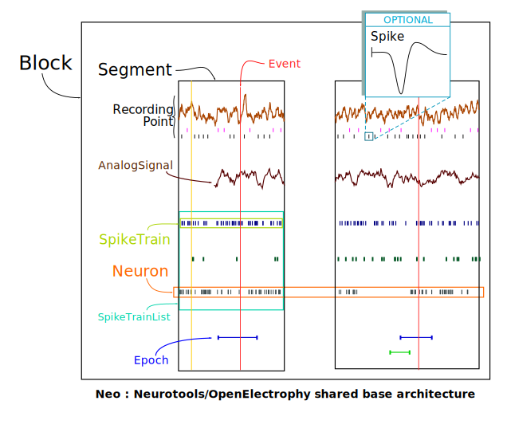

***********
Neo Classes
***********

.. currentmodule:: neo

The neo core consist of a collection of classes that define standards object for manipulating electrophysilogical ( in vivo or simulated) data sets.

This structure attempts to encapsulate the essence of the base data structures previously used in `Neurotools <http://neuralensemble.org/trac/NeuroTools>`_ and in 'OpenElectrophy <http://neuralensemble.org/trac/OpenElectrophy>'_. We also attempt to keep a model similar to the one described by the 'Neuroshare <http://neuroshare.sourceforge.net/index.shtml standard>'_ IO API.

Details description of these classes follows :

.. autoclass:: neo.core.Block
.. autoclass:: neo.core.Segment
.. autoclass:: neo.core.Neuron
.. autoclass:: neo.core.Event
.. autoclass:: neo.core.Epoch
.. autoclass:: neo.core.SpikeTrain
.. autoclass:: neo.core.SpikeTrainList
.. autoclass:: neo.core.AnalogSignal
.. autoclass:: neo.core.AnalogSignalList
.. autoclass:: neo.core.RecordingPoint

