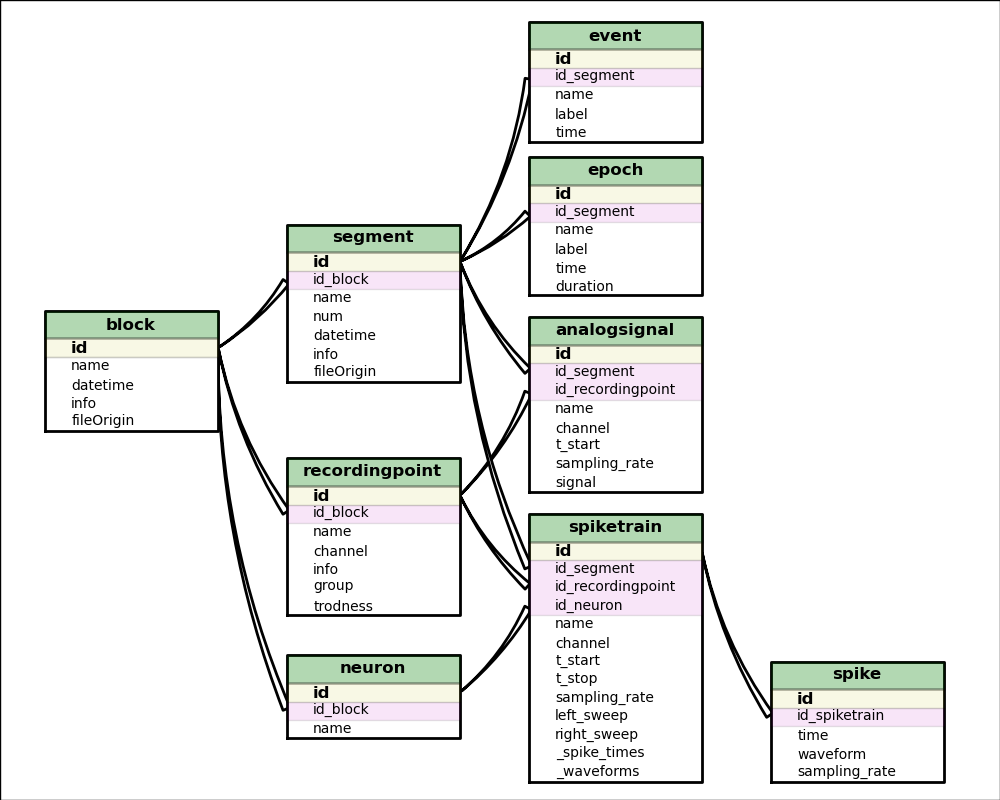

***********
Neo Classes
***********

.. currentmodule:: neo

Introduction
============

The neo core consist of a collection of classes that define standard objects for manipulating electrophysiological (real or simulated) data sets.

.. image:: images/base_schematic.png
   :height: 500 px
   :alt: Neo : Neurotools/OpenElectrophy shared base architecture 
   :align: center

This structure attempts to encapsulate the essence of the base data structures previously used
in `NeuroTools <http://neuralensemble.org/NeuroTools>`_ and in `OpenElectrophy <http://neuralensemble.org/trac/OpenElectrophy>`_. 
We also attempt to keep a model similar to that described by the `Neuroshare <http://neuroshare.sourceforge.net/index.shtml standard>`_ IO API.

The hierachical respresentation can help in understanding the links between objects :

Features
========

 * As neo is more a nomenclature than a complete tool suite for data analysis, in the first instance, neo objects will stay simple; for complicated behavior you will need to subclass neo objects.
 * Some objects are containers for other neo objects: Block, Segment, Neuron, SpikeTrainList, AnalogSignalList, ...
 * Some objects hold data and have some standard behavior: AnalogSignal, SpikeTrain, Spike ...
 * For all objects, some attributes are required and others are optional.
   Example: AnalogSignal:
   
   * Required: signal, sampling_rate, t_start
   * Optional: channel, name, ...
 
 * A container can access its descendants with get_xxx() or with the property _xxx (where xxx is the child name)
   Example :
   
   * Block.get_segments() or Block._segments
   * Segment.get_analogsignals() or Segment._analogsignals
   * Neuron.get_spiketrains() or Neuron._spiketrains
  
 
 

Detailed description of neo classes
===================================

The best way to understand neo is to look at the definition of each class:

.. autoclass:: neo.Block
.. autoclass:: neo.Segment
.. autoclass:: neo.Neuron
.. autoclass:: neo.Event
.. autoclass:: neo.Epoch
.. autoclass:: neo.SpikeTrain
.. autoclass:: neo.SpikeTrainList
.. autoclass:: neo.AnalogSignal
.. autoclass:: neo.AnalogSignalList
.. autoclass:: neo.RecordingPoint

