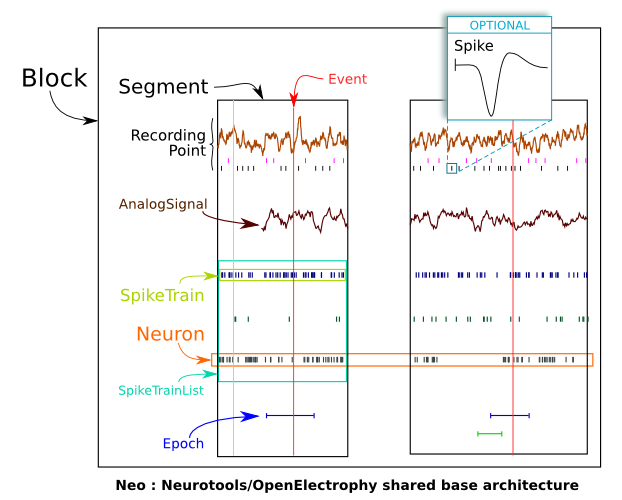

***********
Neo Classes
***********

.. currentmodule:: neo

Introduction
============

The neo core consist of a collection of classes that define standards object for manipulating electrophysilogical ( in vivo or simulated) data sets.

This structure attempts to encapsulate the essence of the base data structures previously used
in `Neurotools <http://neuralensemble.org/trac/NeuroTools>`_ and in `OpenElectrophy <http://neuralensemble.org/trac/OpenElectrophy>`_. 
We also attempt to keep a model similar to the one described by the `Neuroshare <http://neuroshare.sourceforge.net/index.shtml standard>`_ IO API.

Detailed description of neo classes
===================================

The best to understand neo is definition a each class:

.. autoclass:: neo.Block
.. autoclass:: neo.Segment
.. autoclass:: neo.Neuron
.. autoclass:: neo.Event
.. autoclass:: neo.Epoch
.. autoclass:: neo.SpikeTrain
.. autoclass:: neo.SpikeTrainList
.. autoclass:: neo.AnalogSignal
.. autoclass:: neo.AnalogSignalList
.. autoclass:: neo.RecordingPoint

