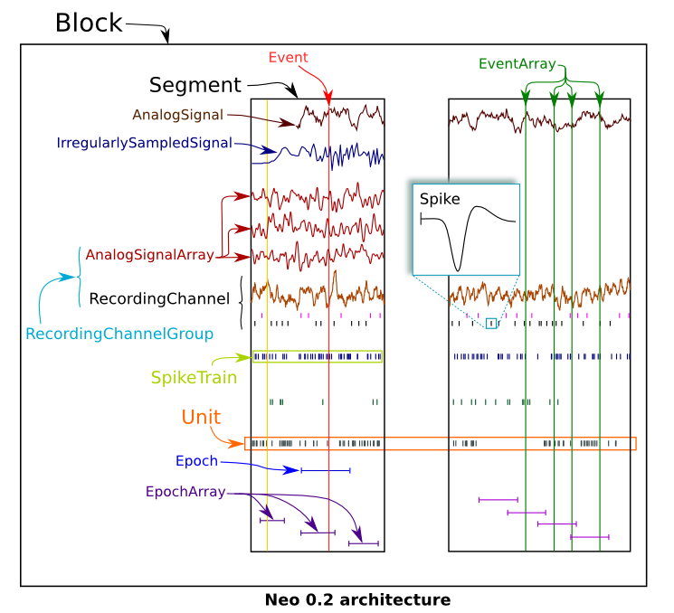
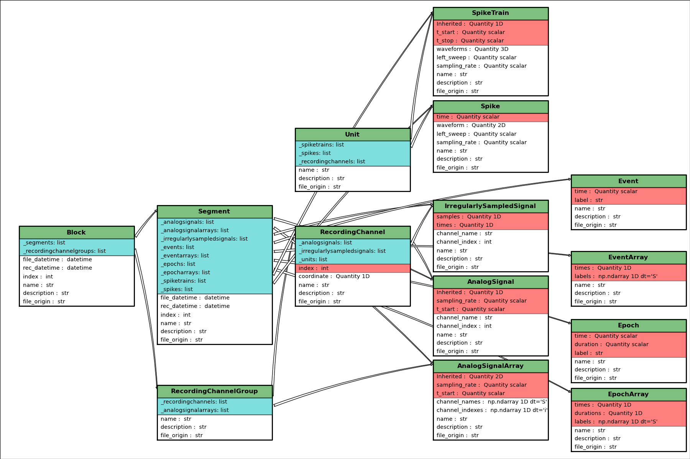

********
Neo core
********

.. currentmodule:: neo

Introduction
============

Objects in Neo represent neural data and collections of data. Neo objects fall
into three categories: data objects, container objects and grouping objects.

Data objects
------------

These objects directly represent data as arrays of numerical values with
associated metadata (units, sampling frequency, etc.).

:py:class:`AnalogSignal`:
    A regular sampling of a continuous, analog signal.

:py:class:`AnalogSignalArray`:
    A regular sampling of a multichannel continuous analog signal. This representation (as a 2D NumPy array) may be more efficient for subsequent analysis than the equivalent list of individual :py:class:`AnalogSignal` objects.

:py:class:`Spike`:
    One action potential characterized by its time and waveform.

:py:class:`SpikeTrain`:
    A set of action potentials (spikes) emitted by the same unit in a period of time (with optional waveforms).

:py:class:`Event` and :py:class:`EventArray`:
    A time point representng an event in the data, or an array of such time points.

:py:class:`Epoch` and :py:class:`EpochArray`:
    An interval of time representing a period of time in the data, or an array of such intervals.

Container objects
-----------------

There is a simple hierarchy of containers:

:py:class:`Segment`:
    A container for heterogeneous discrete or continous data sharing a common clock (time basis) but not necessarily the same sampling rate, start time or end time. A :py:class:`Segment` can be considered as equivalent to a "trial", "episode", "run", "recording", etc., depending on the experimental context. May contain any of the data objects.

:py:class:`Block`:
    The top-level container gathering all of the data, discrete and continuous, for a given recording session. Contains :class:`Segment` and :class:`RecordingChannelGroup` objects.

Grouping objects
----------------

These objects express the relationships between data items, such as which signals
were recorded on which electrodes, which spike trains were obtained from which
membrane potential signals, etc. They contain references to data objects that
cut across the simple container hierarchy.

:py:class:`RecordingChannel`:
    Links :py:class:`AnalogSignal`, :py:class:`SpikeTrain`
    objects that come from the same logical and/or physical channel inside a :py:class:`Block`, possibly across  several :py:class:`Segment` objects.

:py:class:`RecordingChannelGroup`:
    A group for associated :py:class:`RecordingChannel` objects. This has several possible uses: 
      * for linking several :py:class:`AnalogSignalArray` objects across several  :py:class:`Segment` objects inside a  :py:class:`Block`.
      * for multielectrode arrays, where spikes may be recorded on more than one recording channel, 
        and so the :py:class:`RecordingChannelGroup` can be used to associate each :py:class:`Unit` with the
        group of recording channels from which it was calculated.
      * for grouping several :py:class:`RecordingChannel` objects. There are many use cases for this.
        For instance, for intracellular recording, it is common to record both membrane potentials and currents at the same time, 
        so each :py:class:`RecordingChannelGroup` may correspond to the particular property that is being recorded. For multielectrode arrays,
        :py:class:`RecordingChannelGroup` is used to gather all :py:class:`RecordingChannel` objects of the same array.
        
:py:class:`Unit`:
    A Unit gathers all the :class:`SpikeTrain` objects within a common :class:`Block`, possibly across several
    Segments, that have been emitted by the same cell. 
    A :class:`Unit` is linked to :class:`RecordingChannelGroup` objects from which it was detected.
    This replaces the :class:`Neuron` class in the previous version of Neo (v0.1).

Relationships between objects
=============================

Container objects like :py:class:`Block` or :py:class:`Segment` are gateways to
access other objects. For example, a :class:`Block` can access a :class:`Segment`
with::
     
    >>> bl = Block()
    >>> bl.segments
    # gives a list of segments

A :class:`Segment` can access the :class:`AnalogSignal` objects that it contains with::
    
    >>> seg = Segment()
    >>> seg.analogsignals
    # gives a list a AnalogSignals
    
In the :ref:`neo_diagram` below, these *one to many* relationships are represented by cyan arrows.
In general, an object can access its children with an attribute *childname+s* in lower case, e.g.

    * :attr:`Block.segments`
    * :attr:`Segments.analogsignals`
    * :attr:`Segments.spiketrains`
    * :attr:`Block.recordingchannelgroups`

These relationships are bi-directional, i.e. a child object can access its parent:

    * :attr:`Segment.block`
    * :attr:`AnalogSignal.segment`
    * :attr:`SpikeTrains.segment`
    * :attr:`RecordingChannelGroup.block`

Here is an example showing these relationships in use::

    from neo.io import AxonIO
    import urllib
    url = "https://portal.g-node.org/neo/axon/File_axon_3.abf"
    filename = './test.abf'
    urllib.urlretrieve(url, filename)

    r = AxonIO(filename=filename)
    bl = r.read() # read the entire file > a Block
    print(bl)
    print(bl.segments) # child access
    for seg in bl.segments:
        print(seg)
        print(seg.block) # parent access

On the :ref:`neo_diagram` you can also see a magenta line reflecting the *many-to-many* relationship between :py:class:`RecordingChannel` and :py:class:`RecordingChannelGroup`. This means that each group can contain multiple channels, and each channel can belong to multiple groups.

In some cases, a one-to-many relationship is sufficient. Here is a simple example with tetrodes, in which each tetrode has its own group.::

    from neo import *
    bl = Block()
    
    # creating individual channel
    all_rc= [ ]
    for i in range(16):
        rc = RecordingChannel( index= i, name ='rc %d' %i)
        all_rc.append(rc)
    
    # the four tetrodes
    for i in range(4):
        rcg = RecordingChannelGroup( name = 'Tetrode %d' % i )
        for rc in all_rc[i*4:(i+1)*4]:
            rcg.recordingchannels.append(rc)
            rc.recordingchannelgroups.append(rcg)
        bl.recordingchannelgroups.append(rcg)

    # now we load the data and associate it with the created channels
    # ...

Now consider a more complex example: a 1x4 silicon probe, with a neuron on channels 0,1,2 and another neuron on channels 1,2,3. We create a group for each neuron to hold the `Unit` object associated with this spikesorting group. Each group also contains the channels on which that neuron spiked. The relationship is many-to-many because channels 1 and 2 occur in multiple groups.::

    from neo import *
    bl = Block(name='probe data')

    # create individual channels
    all_rc = []
    for i in range(4):
        rc = RecordingChannel(index=i, name='channel %d' % i)
        all_rc.append(rc)

    # one group for each neuron
    rcg0 = RecordingChannelGroup(name='Group 0', index=0)
    for i in [0, 1, 2]:
        rcg1.recordingchannels.append(all_rc[i])
        rc[i].recordingchannelgroups.append(rcg0)
    bl.recordingchannelgroups.append(rcg0)

    rcg1 = RecordingChannelGroup(name='Group 1', index=1)
    for i in [1, 2, 3]:
        rcg1.recordingchannels.append(all_rc[i])
        rc[i].recordingchannelgroups.append(rcg1)
    bl.recordingchannelgroups.append(rcg1)

    # now we add the spiketrain from Unit 0 to rcg0
    # and add the spiketrain from Unit 1 to rcg1
    # ...

Note that because neurons are sorted from groups of channels in this situation, it is natural that the :py:class:`RecordingChannelGroup` contains the :py:class:`Unit` object. That unit then contains its spiketrains.

There are some shortcuts for IO writers to automatically create this structure based on 'channel_indexes' entries in the annotations for each spiketrain.

See :doc:`usecases` for more examples of how the different objects may be used.

.. _neo_diagram:

Neo diagram
===========

Object:
  * With a star = inherits from :class:`Quantity`
Attributes:
  * In red = required
  * In white = recommended
Relationship:
  * In cyan = one to many
  * In magenta = many to many
  * In yellow = properties (deduced from other relationships)

:download:`Click here for a better quality SVG diagram <./images/simple_generated_diagram.svg>`

For more details, see the :doc:`api_reference`.

    

Inheritance
===========

Some Neo objects (:py:class:`AnalogSignal`, :py:class:`SpikeTrain`, :py:class:`AnalogSignalArray`) inherit from :py:class:`Quantity`, which in turn inherits from NumPy :py:class:`ndarray`. This means that a Neo :py:class:`AnalogSignal` actually is also a :py:class:`Quantity` and an array, giving you access to all of the methods available for those objects.

For example, you can pass a :py:class:`SpikeTrain` directly to the :py:func:`numpy.histogram` function, or an :py:class:`AnalogSignal` directly to the :py:func:`numpy.std` function.

Initialization
==============

Neo objects are initialized with "required", "recommended", and "additional" arguments.

    - Required arguments MUST be provided at the time of initialization. They are used in the construction of the object.
    - Recommended arguments may be provided at the time of initialization. They are accessible as Python attributes. They can also be set or modified after initialization.
    - Additional arguments are defined by the user and are not part of the Neo object model. A primary goal of the Neo project is extensibility. These additional arguments are entries in an attribute of the object: a Python dict called :py:attr:`annotations`.

Example: SpikeTrain
-------------------

:py:class:`SpikeTrain` is a :py:class:`Quantity`, which is a NumPy array containing values with physical dimensions. The spike times are a required attribute, because the dimensionality of the spike times determines the way in which the :py:class:`Quantity` is constructed.

Here is how you initialize a :py:class:`SpikeTrain` with required arguments::

    >>> import neo
    >>> st = neo.SpikeTrain([3, 4, 5], units='sec', t_stop=10.0)
    >>> print(st)
    [ 3.  4.  5.] s

You will see the spike times printed in a nice format including the units.
Because `st` "is a" :py:class:`Quantity` array with units of seconds, it absolutely must have this information at the time of initialization. You can specify the spike times with a keyword argument too::

    >>> st = neo.SpikeTrain(times=[3, 4, 5], units='sec', t_stop=10.0)

The spike times could also be in a NumPy array.

If it is not specified, :attr:`t_start` is assumed to be zero, but another value can easily be specified::

    >>> st = neo.SpikeTrain(times=[3, 4, 5], units='sec', t_start=1.0, t_stop=10.0)
    >>> st.t_start
    array(1.0) * s

Recommended attributes must be specified as keyword arguments, not positional arguments.

Finally, let's consider "additional arguments". These are the ones you define for your experiment::

    >>> st = neo.SpikeTrain(times=[3, 4, 5], units='sec', t_stop=10.0, rat_name='Fred')
    >>> print(st.annotations)
    {'rat_name': 'Fred'}
    
Because ``rat_name`` is not part of the Neo object model, it is placed in the dict :py:attr:`annotations`. This dict can be modified as necessary by your code.

Annotations
-----------

As well as adding annotations as "additional" arguments when an object is
constructed, objects may be annotated using the :meth:`annotate` method
possessed by all Neo core objects, e.g.::

    >>> seg = Segment()
    >>> seg.annotate(stimulus="step pulse", amplitude=10*nA)
    >>> print(seg.annotations)
    {'amplitude': array(10.0) * nA, 'stimulus': 'step pulse'}

Since annotations may be written to a file or database, there are some
limitations on the data types of annotations: they must be "simple" types or
containers (lists, dicts, NumPy arrays) of simple types, where the simple types
are ``integer``, ``float``, ``complex``, ``Quantity``, ``string``, ``date``, ``time`` and
``datetime``.

See :ref:`specific_annotations`
