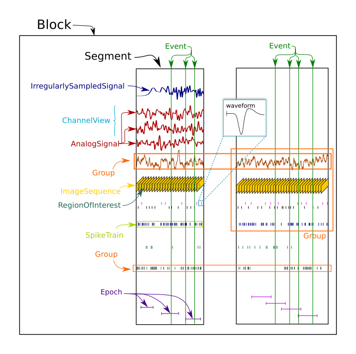

***********
Neo core
***********

.. currentmodule:: neo

Introduction
============
Objects in Neo represent neural data. They are connected hierarchically to show the logical linkages between the objects.

Block: The main container gathering all of the data, discrete and continuous, for a given recording session.

Segment: A Segment is a heterogeneous container for discrete or continous data data sharing a common clock (time basis) but not necessary the same sampling rate, t_start and t_stop.

AnalogSignal: A representation of continuous, analog signal acquired at time ``t_start`` at a certain sampling rate.

SpikeTrain: An ensemble of action potentials (spikes) emitted by the same unit in a period of time.

RecordingChannel: A RecordingChannel is a container of AnalogSignal or SpikeTrain or Unit that come from the same logical and/or physical channel inside a Block.

RecordingChannelGroup: A container inside a Block of some RecordingChannel. Spikes are sorted from more than one recording channel. Therefore each SpikeTrain is associated with the group of recording channels on which it was calculated.

Inheritance
===========
Some Neo objects (AnalogSignal, SpikeTrain) inherit from Quantity, which in turn inherits from Numpy arrays. This means that a Neo AnalogSignal actually is also a Quantity and an array, giving you access to all of the methods available for those objects.

For example, you can pass a SpikeTrain directly to the numpy.histogram method. Or you can pass an AnalogSignal directly to the numpy.std method.

Initialization
==============
Neo objects are initialized with "required", "recommended", and "additional" arguments.

    - Required arguments MUST be provided at the time of initialization. They are used in the construction of the underlying Numpy object.
    - Recommended arguments may be provided at the time of initialization. They are accessible as Python attributes. They can also be set or modified after initialization.
    - Additional arguments are defined by the user (you!) and are not part of the Neo object model. A primary goal of the Neo project is extensibility. These additional arguments are entries in an attribute of the object: a Python dict called _annotations.

Example: SpikeTrain
SpikeTrain is a Quantity, which is a Numpy array with dimensionality. The spike times are a required attribute, because the dimensionality of the spike times determines the way in which the Quantity is constructed.

Here is how you initialize a SpikeTrain with required arguments.::

        import neo
        import quantity as pq
        st = neo.SpikeTrain(times=pq.Quantity([3, 4, 5], units='sec'))
        print st

You will see the spike times printed in a nice format including the units.

Because `st` "is a" Quantity array with units 'sec', it absolutely must have this information at the time of initialization. You can specify them with a keyword argument too::

    st = neo.SpikeTrain(times=[3, 4, 5], units='sec')

In practice, much more information than the raw spike times is necessary to analyze this data. This information falls into the realm of "recommended attributes". For example, at what time did this particular spike train start? ::

    st = neo.SpikeTrain(times=[3, 4, 5], units='sec')
    st.t_start = 1.0

Here we set t_start like a normal Python attribute, but we could also have provided it as a keyword to initialization.

Recommended attributes must be specified as keyword arguments, not simple ordered arguments.

[Note for developers: A glance at the underlying code reveals the implementation distinction between required and recommended attributes. Required attributes are set in object.__new__(), while recommended attributes are set in object.__init__()]

Finally, let's consider "additional arguments". These are the ones you define for your experiment. ::

    st = neo.SpikeTrain(times=[3, 4, 5], units='sec', ratname='Fred')\
    print st._annotations

Because 'ratname' is not part of the Neo object model, it is placed in the dict called _annotations. This dict can be modified as necessary by your code.

Diagrams
========

The hierachical respresentation can help in understanding the links between objects :

.. image:: images/neo_UML_French_workshop.png
   :height: 500 px
   :align: center

