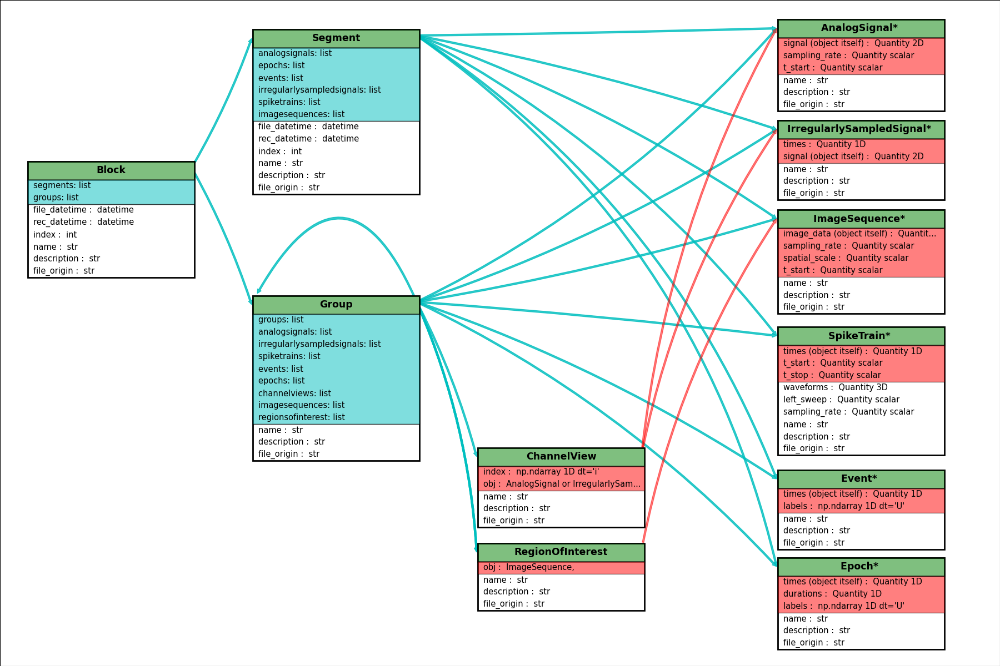

.. _core_page:

***********
Neo core
***********

.. currentmodule:: neo

Introduction
============
Objects in Neo represent neural data. They are connected hierarchically to show the logical linkages between the objects.

:py:class:`Block`: The main container gathering all of the data, discrete and continuous, for a given recording session.

:py:class:`Segment`: A heterogeneous container for discrete or continous data sharing a common clock (time basis) but not necessarily the same sampling rate, start time or end time.
In different contexts, a :py:class:`Segment` could be equivalent to a "trial", "episode", "run", "recording", etc. The concept of :py:class:`Segment` is fuzzy enought to cover many cases.

:py:class:`AnalogSignal`: A representation of a continuous, analog signal acquired at time ``t_start`` at a certain sampling rate.

:py:class:`AnalogSignalArray`: A representation of multiple continuous, analog signals, all acquired the the same time and with the same sampling rate. This representation (as a 2D NumPy array) may be more efficient for subsequent analysis than the equivalent list of individual :py:class:`AnalogSignal` objects.

:py:class:`SpikeTrain`: An ensemble of action potentials (spikes) emitted by the same unit in a period of time.

:py:class:`RecordingChannel`: A container of :py:class:`AnalogSignal`, :py:class:`SpikeTrain` or :py:class:`Unit` objects that come from the same logical and/or physical channel inside a :py:class:`Block`.

:py:class:`RecordingChannelGroup`: A container for associated :py:class:`RecordingChannel` objects. This has several possible uses. For multielectrode arrays, spikes may be recorded on more than one recording channel, and so the :py:class:`RecordingChannelGroup` can be used to associate each :py:class:`SpikeTrain` with the group of recording channels on which it was calculated. For intracellular recording, it is common to record both membrane potentials and currents at the same time, so each :py:class:`RecordingChannelGroup` may correspond to the particular property that is being recorded.

See :ref:`use_cases_page` for examples of how the different objects may be used.

Inheritance
===========

Some Neo objects (:py:class:`AnalogSignal`, :py:class:`SpikeTrain`, :py:class:`AnalogSignalArray`) inherit from :py:class:`Quantity`, which in turn inherits from NumPy :py:class:`ndarray`. This means that a Neo :py:class:`AnalogSignal` actually is also a :py:class:`Quantity` and an array, giving you access to all of the methods available for those objects.

For example, you can pass a :py:class:`SpikeTrain` directly to the :py:func:`numpy.histogram` function, or an :py:class:`AnalogSignal` directly to the :py:func:`numpy.std` function.

Initialization
==============

Neo objects are initialized with "required", "recommended", and "additional" arguments.

    - Required arguments MUST be provided at the time of initialization. They are used in the construction of the object.
    - Recommended arguments may be provided at the time of initialization. They are accessible as Python attributes. They can also be set or modified after initialization.
    - Additional arguments are defined by the user and are not part of the Neo object model. A primary goal of the Neo project is extensibility. These additional arguments are entries in an attribute of the object: a Python dict called :py:attr:`_annotations`.

Example: SpikeTrain
-------------------

:py:class:`SpikeTrain` is a :py:class:`Quantity`, which is a NumPy array with dimensionality. The spike times are a required attribute, because the dimensionality of the spike times determines the way in which the :py:class:`Quantity` is constructed.

Here is how you initialize a :py:class:`SpikeTrain` with required arguments::

    >>> import neo
    >>> st = neo.SpikeTrain([3, 4, 5], units='sec')
    >>> print(st)
    [ 3.  4.  5.] s

You will see the spike times printed in a nice format including the units.
Because `st` "is a" :py:class:`Quantity` array with units of seconds, it absolutely must have this information at the time of initialization. You can specify the spike times with a keyword argument too::

    >>> st = neo.SpikeTrain(times=[3, 4, 5], units='sec')

The spike times could also be in a NumPy array.

In practice, much more information than the raw spike times is necessary to analyze this data. This information falls into the realm of "recommended attributes". For example, at what time did this particular spike train start and finish? ::

    >>> st = neo.SpikeTrain(times=[3, 4, 5], units='sec', t_start=1.0, t_stop=10.0)
    >>> st.t_start
    array(1.0) * s

Recommended attributes must be specified as keyword arguments, not positional arguments.

.. note:: Note for developers: A glance at the underlying code reveals the implementation distinction between required and recommended attributes. Required attributes are set in :py:meth:`object.__new__`, while recommended attributes are set in :py:meth:`object.__init__`

Finally, let's consider "additional arguments". These are the ones you define for your experiment. ::

    >>> st = neo.SpikeTrain(times=[3, 4, 5], units='sec', rat_name='Fred')
    >>> print(st._annotations)
    {'rat_name': 'Fred'}
    

Because ``rat_name`` is not part of the Neo object model, it is placed in the dict :py:attr:`_annotations`. This dict can be modified as necessary by your code.

Diagrams
========

.. image:: images/base_schematic.png
   :height: 500 px
   :alt: Neo : Neurotools/OpenElectrophy shared base architecture 
   :align: center

The hierachical respresentation can help in understanding the links between objects :

:download:`Click here for better quality SVG diagram <./images/simple_generated_diagram.svg>`

Reference
=========

.. automodule:: neo.core

