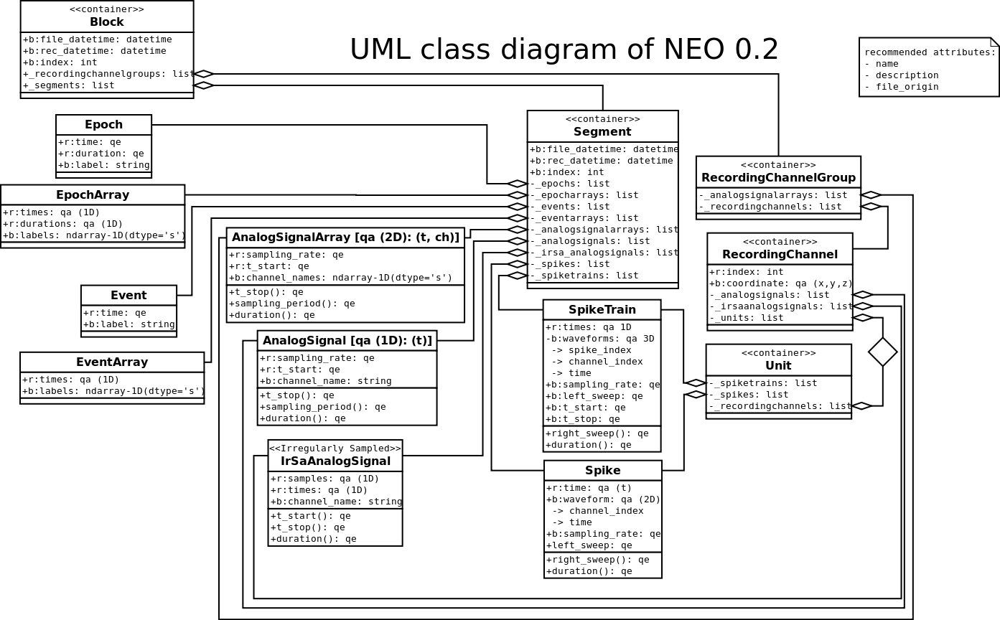

************************************
Gif 2011 workshop decisions
************************************

This have been writtent before neo 2 implementation just after the wokshop. Not every hting is up to date.

After a workshop in GIF we are happy to present the following improvements: 
===========================================================================

1. We made a few renames of objects
    - "Neuron" into "Unit"
    - "RecordingPoint" into "RecordingChannel"
    
 to remove electrophysiological (or other) dependencies and keep generality.

2. For every object we specified mandatory attributes and recommended attributes. For every attribute we define a python-based data type. The changes are reflected in the diagram #FIXME with red (mandatory) and blue (recommended) attributes indicated.

3. New objects are required for operational performance (memory allocation) and logical consistency (neo eeg, etc):
    - AnalogSignalArray
    - IrregularlySampledAnalogSignal
    - EventArray
    - EpochArray
    - RecordingChannelGroup
    
Attributes and parent objects are available on the diagram #FIXME

4. Due to some logical considerations we remove the link between "RecordingChannel" and "Spiketrain". "SpikeTrain" now depends on "Unit", which in its turn connects to "RecordingChannel". For inconsistency reasons we removed  link between "SpikeTrain" and a "Spike" ("SpikeTrain" is an object containing numpy array of spikes, but not a container of "Spike" objects - which is performance-unefficient). The same idea is applied to AnalogSignal / AnalogSignalArray, Event / EventArray etc. All changes are relected in # FIXME

5. In order to implement flexibility and embed user-defined metadata into the NEO objects we decided to assign "annotations" dictionnary to very NEO object. This attribute is optional; user may add key-value pairs to it according to its scientific needs.

6. The decision is made to use "quantities" package for objects, representing data arrays with units. "Quantities" is a stable (at least for python2.6) package, presented in pypi, easy-embeddable into NEO object model. Points of implementation are presented in the diagram # FIXME

7. We postpone the solution of object ID management inside NEO.

8. In AnalogSignal - t_stop become a property (for consistency reasons).

9. In order to provie a support for "advanced" object load we decided to include parameters
    - lazy (True/False)
    - cascade (True/False)
    
in the BaseIO class. These parameters are valid for every method, provided by the IO (.read_segment() etc.). If "lazy" is True, the IO does not load data array, and makes array load otherwise. "Cascade" parameter regulates load of object relations.

10. We postpone the question of data analysis storage till the next NEO congress. Analysis objects are free for the moment.

11. We stay with Python 2.6 / 2.7 support. Python 3 to be considered in a later discussions.

New object diagram discussed
===============================================

Actions to be performed:
===============================================================
promotion:
    at g-node: philipp, andrey
    in neuralesemble: andrew
    within incf network: andrew thomas
    at posters: all
    logo: samuel
    paper: next year
    in the web: pypi

object struture:
    common: samuel
    draft: yann andrey    
    tree diagram: philipp florant
    
io: 
    ExampleIO : samuel
    HDF5 IO: andrey

doc:
    first page: andrew thomas
    object disription: samuel draft+ andrew
    io user/ io dev:  samuel
    example/cookbook: andrey script, samuel NeuroConvert, doctest
    
unitest:
    andrew

packaging:
    samuel
    account for more

licence: 
    BSD

copyright:
    CNRS, GNode, University of Provence

hosting test data:
    Philipp

Other questions discussed:
===========================
 - consistency in names of object attributes and get/set functions
 