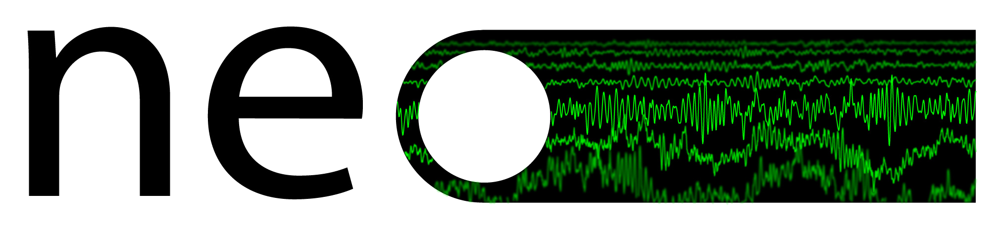

.. module:: neo

    
Neo is a package for representing electrophysiology data in Python, together
with support for reading a wide range of neurophysiology file formats, including
Spike2, NeuroExplorer, AlphaOmega, Axon, Blackrock, Plexon, Tdt, and support for
writing to a subset of these formats plus non-proprietary formats including HDF5.

The goal of Neo is to improve interoperability between Python tools for
analyzing, visualizing and generating electrophysiology data (such as
OpenElectrophy_, NeuroTools_, G-node_, Helmholtz_, PyNN_) by providing a common,
shared object model. In order to be as lightweight a dependency as possible,
Neo is deliberately limited to represention of data, with no functions for data
analysis or visualization.

Neo implements a hierarchical data model well adapted to intracellular and
extracellular electrophysiology and EEG data with support for multi-electrodes
(for example tetrodes). Neo's data objects build on the quantities_ package,
which in turn builds on NumPy by adding support for physical dimensions. Thus
Neo objects behave just like normal NumPy arrays, but with additional metadata,
checks for dimensional consistency and automatic unit conversion.

A project with similar aims but for neuroimaging file formats is `NiBabel`_.

Documentation
-------------

.. toctree::
   :maxdepth: 1
   
   install
   core
   usecases
   io
   examples
   api_reference
   whatisnew
   developers_guide
   io_developers_guide
   authors

License
-------

Neo is distributed under a BSD licence.

Contributing
------------

The people behind the project (see :doc:`authors`) are very open to discussion. Any feedback is
gladly received and highly appreciated! Discussion of Neo takes place on the
`NeuralEnsemble mailing list <http://groups.google.com/group/neuralensemble>`_::

    http://groups.google.com/group/neuralensemble
    
`Source code <http://neuralensemble.org/trac/neo/browser>`_ and the `bug tracker <http://neuralensemble.org/trac/neo/report>`_ are at::

    http://neuralensemble.org/trac/neo

.. _OpenElectrophy: http://neuralensemble.org/trac/OpenElectrophy
.. _NeuroTools: http://neuralensemble.org/NeuroTools
.. _G-node: http://www.g-node.org/
.. _Neuroshare: http://neuroshare.org/
.. _Helmholtz: https://www.dbunic.cnrs-gif.fr/documentation/helmholtz/
.. _NiBabel: http://nipy.sourceforge.net/nibabel/
.. _PyNN: http://neuralensemble.org/PyNN
.. _quantities: http://pypi.python.org/pypi/quantities
