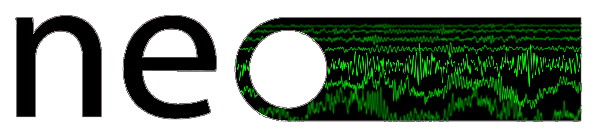

.. title:: Neo documentation

.. The page title must be in rST for it to show in next/prev page buttons.
   Therefore we add a special style rule to only this page that hides h1 tags
   (thank you MNE Python for this idea)

.. raw:: html

    

=================
Neo documentation
=================

.. grid::

    .. grid-item-card::

       Neo is a Python package for working with **electrophysiology data**.

       It implements a hierarchical data model well adapted to intracellular and
       extracellular electrophysiology and EEG data.

    .. grid-item-card::

       Goal: improve **interoperability** between Python tools for
       analyzing, visualizing and generating electrophysiology data, by providing a **common,
       shared object model**.

    .. grid-item-card::

       .. image:: images/incf_endorsed_with_spacing.png
          :width: 100%
          :alt: Endorsed as a community standard by INCF
          :target: https://www.incf.org/sbp/neo

.. grid::

    .. grid-item-card::

        Support for reading a **wide range of neurophysiology file formats**,
        including Spike2, NeuroExplorer, AlphaOmega, Axon, Blackrock, Plexon, Tdt and Igor Pro,
        and for writing to **open formats** such as NWB and NIX.

    .. grid-item-card::

      Neo objects behave just like **normal NumPy arrays**, but with additional **metadata**,
      checks for **dimensional consistency** and **automatic unit conversion**.

    .. grid-item-card::

       In order to be as **lightweight** a dependency as possible,
       Neo is deliberately limited to represention of data, with no functions for data
       analysis or visualization.

.. image:: images/neologo.png
  :width: 100%
  :alt: Neo logo
  :class: only-light

.. toctree::
   :hidden:
   :maxdepth: 1

   Download & Install <install>
   Read and analyze data <read_and_analyze>
   Share data in an open format <share_data>
   Use Neo in a library or app <use_neo_as_dependency>
   Add support for a new file format <add_file_format>
   examples/index
   Report a bug, request a feature <bug_reports>
   Contribute to Neo <contributing>
   Who else is using Neo? <neo_users>
   API reference <api_reference>
   rawio
   Supported formats <iolist>
   rawiolist
   releases
   authors
   governance

.. grid::

   .. grid-item-card:: Download & Install
      :link: install.html

   .. grid-item-card:: Read and analyze data
      :link: read_and_analyze.html

   .. grid-item-card:: Share data in an open format
      :link: share_data.html

.. grid::

   .. grid-item-card:: Use Neo in a library or app
      :link: use_neo_as_dependency.html

   .. grid-item-card:: Add support for a new file format
      :link: add_file_format.html

   .. grid-item-card:: Examples
      :link: examples/index.html

.. grid::

   .. grid-item-card:: Report a bug or request a new feature
      :link: bug_reports.html

   .. grid-item-card:: Contribute to Neo
      :link: contributing.html

   .. grid-item-card:: See who is using Neo
      :link: neo_users.html

.. grid::

   .. grid-item-card:: API reference
      :link: api_reference.html

   .. grid-item-card:: Optimisation of performance and memory consumption
      :link: rawio.html

   .. grid-item-card:: Supported file formats
      :link: iolist.html
