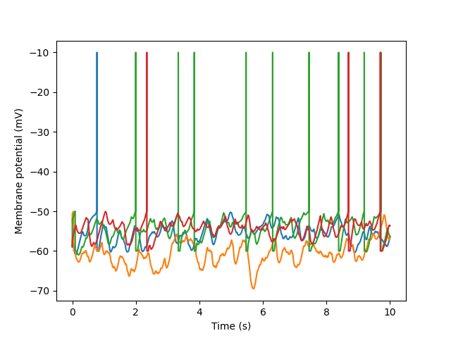

===================================
Reading and analyzing data with Neo
===================================

.. currentmodule:: neo.core

Getting started
===============

Neo is a library for working with neurophysiology data in the Python programming language.
One of the big advantages of Neo is that it works with many different file formats:
it doesn't matter which format your data is stored in, Neo provides a standard way to read the data,
and then represents it in a standardised way, as a set of Python objects.

.. loading data with an IO module

The first step in reading data is to import the appropriate Neo input-output (or IO) module for your data.
For this example, we're going to work with membrane potential traces stored in a text file,
so we use the :class:`~neo.io.AsciiSignalIO` module:

.. ipython::

    In [1]: from neo.io import AsciiSignalIO

    In [2]: data = AsciiSignalIO("example_data.txt", delimiter=" ").read()

.. link to list of IO modules

.. note:: For a full list of IO modules provided by Neo, see :doc:`iolist`.

.. navigating through the tree

.. ipython::

   In [3]: data
   Out[3]:
   [Block with 1 segments
   file_origin: 'example_data.txt'
   # segments (N=1)
   0: Segment with 1 analogsignals
       # analogsignals (N=1)
       0: AnalogSignal with 4 channels of length 10001; units mV; datatype float32
          name: 'multichannel'
          sampling rate: 1.0 kHz
          time: 0.0 s to 10.001 s]

Different data files can contain different amounts of data, from single traces to multiple
recording sessions. To provide consistent behaviour, for all IO modules, the :meth:`read()` method returns a list of data blocks.
A :class:`Block` typically represents a recording session.
Each block contains a list of segments, where each :class:`Segment` contains data recorded at the same time.

In this example file, we see a single type of data, the "analog signal", which represents continuous time series
sampled at a fixed interval. The other types of data that can be contained in a :class:`Segment` are discussed below
under :ref:`section-data-types`.

.. note:: :meth:`read()` reads the entire file into memory at once. If you only want to access part of the data,
          you can do so using Neo's "lazy" data loading - see the section on :ref:`section-performance-memory` below.

.. plotting data

Neo data objects are based on NumPy_ arrays, and behave very similarly.
For example, they can be plotted just like arrays:

.. ipython::

    In [4]: import matplotlib.pyplot as plt

    In [5]: signal = data[0].segments[0].analogsignals[0]

    In [6]: plt.plot(signal.times, signal)
    Out[6]:
    [<matplotlib.lines.Line2D at 0x168892970>,
     <matplotlib.lines.Line2D at 0x168892be0>,
     <matplotlib.lines.Line2D at 0x168892d60>,
     <matplotlib.lines.Line2D at 0x168892ee0>]

    In [7]: plt.xlabel(f"Time ({signal.times.units.dimensionality.string})")
    Out[7]: Text(0.5, 0, 'Time (s)')

    In [8]: plt.ylabel(f"Membrane potential ({signal.units.dimensionality.string})")
    Out[8]: Text(0, 0.5, 'Membrane potential (mV)')

    In [9]: plt.savefig("example_plot.png")

.. link to examples.

You now know enough to start using Neo. For more examples, see :doc:`../examples/index`.
If you want to know more, read on.

NumPy
=====

Neo is based on NumPy_. All Neo data classes behave like NumPy arrays, but have extra functionality.

The first addition is support for units.
In contrast to a plain NumPy array, an :class:`AnalogSignal` knows the units of the data it contains, e.g.:

.. ipython::

    In [10]: signal.units
    Out[10]: array(1.) * mV

This helps avoid errors like adding signals with different units,
lets you auto-generate figure axis labels,
and makes it easy to change units, like here from millivolts to volts e.g.:

.. ipython::

    In [11]: signal.magnitude[:5]
    Out[11]:
    array([[-58.469, -52.855, -58.79 , -58.815],
        [-59.061, -50.518, -52.003, -57.24 ],
        [-59.01 , -50.51 , -51.988, -57.199],
        [-58.96 , -50.503, -51.973, -57.158],
        [-58.911, -50.495, -51.958, -57.117]], dtype=float32)

    In [12]: signal.rescale("V").magnitude[:5]
    Out[12]:
    array([[-0.058469  , -0.052855  , -0.05879   , -0.058815  ],
        [-0.059061  , -0.050518  , -0.052003  , -0.05724001],
        [-0.05901   , -0.05051   , -0.051988  , -0.05719901],
        [-0.05896   , -0.050503  , -0.051973  , -0.057158  ],
        [-0.058911  , -0.050495  , -0.051958  , -0.057117  ]],
        dtype=float32)

The second addition is support for structured metadata.
Some of these metadata are *required*.
For example, an :class:`AnalogSignal` must always have a :attr:`sampling_rate` attribute,
and Neo will produce an Exception if you try to add two signals with different sampling rates:

.. ipython::

    In [13]: signal.sampling_rate
    Out[13]: array(1.) * kHz

Some of these metadata are recommended but optional, like a name for each signal.
Such metadata appear as attributes of the data objects:

.. ipython::

    In [14]: signal.name
    Out[14]: 'multichannel'

And finally, some metadata are fully optional.
These are stored in the :attr:`annotations` and :attr:`array_annotations` attributes:

.. ipython::

    In [15]: signal.array_annotations
    Out[15]: {'channel_index': array([0, 1, 2, 3])}

For more information about this, see :ref:`section-annotations`.

.. treating Neo data objects like numpy arrays, quantity arrays, converting between them, rescaling

Most NumPy array methods also work on Neo data objects, e.g.:

.. ipython::

    In [16]: signal.mean()
    Out[16]: array(-56.33598, dtype=float32) * mV

Data objects can be sliced like arrays (array annotations are automatically sliced appropriately):

.. ipython::

    In [17]: signal[100:110, 1:3]
    Out[17]:
    AnalogSignal with 2 channels of length 10; units mV; datatype float32
    name: 'multichannel'
    sampling rate: 1.0 kHz
    time: 0.1 s to 0.11 s

    In [18]: signal[100:110, 1:3].array_annotations
    Out[18]: {'channel_index': array([1, 2])}

To convert a Neo data object to a plain NumPy array, use the :attr:`magnitude` attribute:

.. ipython::

    In [19]: signal[100:110, 1:3].magnitude
    Out[19]:
    array([[-60.654, -60.   ],
        [-60.724, -60.   ],
        [-60.792, -60.   ],
        [-60.859, -60.   ],
        [-60.924, -60.   ],
        [-60.989, -60.   ],
        [-61.052, -60.   ],
        [-61.114, -60.   ],
        [-61.175, -60.   ],
        [-61.234, -60.   ]], dtype=float32)

.. _section-data-types:

Data types
==========

The following classes directly represent data as arrays of numerical values with
associated metadata (units, sampling frequency, etc.).

  * :py:class:`AnalogSignal`: A regular sampling of a single- or multi-channel continuous analog signal.
  * :py:class:`IrregularlySampledSignal`: A non-regular sampling of a single- or multi-channel continuous analog signal.
  * :py:class:`SpikeTrain`: A set of action potentials (spikes) emitted by the same unit in a period of time (with optional waveforms).
  * :py:class:`Event`: An array of time points representing one or more events in the data.
  * :py:class:`Epoch`: An array of time intervals representing one or more periods of time in the data.
  * :py:class:`ImageSequence`: A three dimensional array representing a sequence of images.

AnalogSignal
------------

We have already met the :class:`AnalogSignal`, which represents continuous time series
sampled at a fixed interval.

In addition to reading data from a file, as above, it is also possible to create new signal
objects directly, e.g.:

.. ipython::

    In [20]: import numpy as np

    In [21]: from quantities import mV, kHz

    In [22]: from neo import AnalogSignal

    In [23]: signal = AnalogSignal(np.random.normal(-65.0, 5.0, size=(100, 5)),
       ....:                       units=mV, sampling_rate=1 * kHz)

    In [24]: signal
    Out[24]:
    AnalogSignal with 5 channels of length 100; units mV; datatype float64
    sampling rate: 1.0 kHz
    time: 0.0 s to 0.1 s

IrregularlySampledSignal
------------------------

:class:`IrregularlySampledSignal` represents continuous time series sampled at non-regular time points.
This means that instead of specifying the sampling rate or sampling interval, you must
specify the array of times at which the signal was sampled.

.. ipython::

    In [25]: from quantities import ms, nA

    In [26]: from neo import IrregularlySampledSignal

    In [27]: isignal = IrregularlySampledSignal(
       ....:              times=[0.0, 1.11, 4.27, 16.38, 19.33] * ms,
       ....:              signal=[0.5, 0.8, 0.5, 0.7, 0.2] * nA,
       ....:              description="input current")

    In [28]: isignal
    Out[28]:
    IrregularlySampledSignal with 1 channels of length 5; units nA; datatype float64
    description: 'input current'
    sample times: [ 0.    1.11  4.27 16.38 19.33] ms

.. note:: in case of multi-channel data, samples are assumed to have been taken at the same time points in all channels.
          If you need to specify different time points for different channels, use one signal object per channel.

SpikeTrain
----------

A :class:`SpikeTrain` represents the times of occurrence of action potentials (spikes).

.. ipython::

    In [29]: from neo import SpikeTrain

    In [30]: spike_train = SpikeTrain([3, 4, 5], units='sec', t_stop=10.0)

    In [31]: spike_train
    Out[31]:
    SpikeTrain containing 3 spikes; units s; datatype float64
    time: 0.0 s to 10.0 s

It may also contain the waveforms of the action potentials, stored as :class:`AnalogSignals`
*within* the spike train object - see the reference documentation for more on this.

Event
-----

It is common in electrophysiology experiments to record the times of specific events,
such as the times at which stimuli are presented.
An :class:`Event` contains an array of times at which events occurred,
together with an *optional* array of labels for the events, e.g.:

.. ipython::

    In [32]: from neo import Event

    In [33]: events = Event(np.array([5, 15, 25]), units="second",
       ....:                labels=["apple", "rock", "elephant"],
       ....:                name="stimulus onset")

    In [34]: events
    Out[34]:
    Event containing 3 events with labels; time units s; datatype int64
    name: 'stimulus onset'

Epoch
-----

A variation of events is where something occurs over a certain period of time,
in which case we need to know both the start time and the duration.
An :class:`Epoch` contains an array of start or onset times together with an
array of durations (or a single value if all epochs have the same duration),
and an optional array of labels.

.. ipython::

    In [35]: from neo import Epoch

    In [36]: epochs = Epoch(times=np.array([5, 15, 25]),
       ....:                durations=2.0,
       ....:                units="second",
       ....:                labels=["apple", "rock", "elephant"],
       ....:                name="stimulus presentations")

    In [37]: epochs
    Out[37]:
    Epoch containing 3 epochs with labels; time units s; datatype int64
    name: 'stimulus presentations'

ImageSequence
-------------

In addition to electrophysiology, neurophysiology signals may be obtained through functional microscopy.
The :class:`ImageSequence` class represents a sequence of images, as a 3D array organized as [frame][row][column].
It behaves similarly to :class:`AnalogSignal`, but in 3D rather than 2D.

.. ipython::

    In [38]: from quantities import Hz, micrometer

    In [39]: from neo import ImageSequence

    In [40]: img_sequence_array = [[[column for column in range(20)]for row in range(20)]
       ....:                       for frame in range(10)]

    In [41]: image_sequence = ImageSequence(img_sequence_array, units='dimensionless',
       ....:                                sampling_rate=1 * Hz,
       ....:                                spatial_scale=1 * micrometer)

    In [42]: image_sequence
    Out[42]:
    ImageSequence 10 frames with width 20 px and height 20 px; units dimensionless; datatype int64
    sampling rate: 1.0 Hz
    spatial_scale: 1.0 um

.. _section-annotations:

Annotations
===========

.. and array annotations

Neo objects have certain *required* metadata, such as the :attr:`sampling_rate` for :class:`AnalogSignals`.
There are also certain *recommended* metadata, such as a name and description.
For any metadata not covered by the required or recommended fields, additional annotations can be added, e.g.:

.. ipython::

    In [43]: from quantities import um as µm

    In [44]: signal.annotate(pipette_tip_diameter=1.5 * µm)

    In [45]: signal.annotations
    Out[45]: {'pipette_tip_diameter': array(1.5) * um}

For those IO modules that support writing data to file, annotations will also be written,
provided they can be serialized to JSON format.

.. todo: we should provide a custom ``JSONEncoder`` that supports quantities

Array annotations
-----------------

Since certain Neo objects contain array data,
it is sometimes necessary to annotate individual array elements, or individual columns.

For 1D arrays, the array annotations should have the same length as the array, e.g.

.. ipython::

    In [46]: events.shape

    In [47]: events.array_annotate(secondary_labels=["red", "green", "blue"])

For 2D arrays, the array annotations should match the shape of the channel dimension, e.g.

.. ipython::

    In [48]: signal.shape

    In [49]: signal.array_annotate(quality=["good", "good", "noisy", "good", "noisy"])

Dataset structure
=================

The overall structure of a Neo dataset is shown in this figure:

.. image:: images/base_schematic.png
   :height: 500 px
   :alt: Illustration of the main Neo data types
   :align: center

Beyond the core data classes, Neo has various classes for grouping and structuring different data objects.
We have already met two of them, the :class:`Block` and :class:`Segment`.

Tree structure
--------------

:class:`Block` and :class:`Segment` provide a basic two-level hierarchical structure:
:class:`Blocks` contain :class:`Segments`, which contain data objects.

:class:`Segments` are used to group data that have a common time basis, i.e. that were recorded at the same time.
A :class:`Segment` can be considered as equivalent to a "trial", "episode", "run", "recording", etc.,
depending on the experimental context.

:class:`Segments` have the following attributes, used to access lists of data objects:

- :attr:`analogsignals`
- :attr:`epochs`
- :attr:`events`
- :attr:`imagesequences`
- :attr:`irregularlysampledsignals`
- :attr:`spiketrains`

:class:`Block` is the top-level container gathering all of the data, discrete and continuous, for a given recording session.
It contains :class:`Segment` and :class:`Group` (see next section) objects in the attributes :attr:`segments` and :attr:`groups`.

Grouping and linking objects
----------------------------

Sometimes your data have a structure that goes beyond a simple two-level hierarchy.
For example, suppose that you wish to group together signals that were recorded from the same tetrode in multi-tetrode recording setup.

For this, Neo provides a :class:`Group` class:

.. ipython::

    In [50]: from neo import Group

    In [51]: signal1 = AnalogSignal(np.random.normal(-65.0, 5.0, size=(100, 5)), units=mV, sampling_rate=1 * kHz)

    In [52]: signal2 = AnalogSignal(np.random.normal(-65.0, 5.0, size=(1000, 5)), units=nA, sampling_rate=10 * kHz)

    In [53]: group = Group(objects=(signal1, signal2))

    In [54]: group
    Out[54]: Group with 2 analogsignals

Since :class:`AnalogSignals` can contain data from multiple channels,
sometimes we wish to include only a subset of channels in a group.
For this, Neo provides the :class:`ChannelView` class, e.g.:

.. ipython::

    In [55]: from neo import ChannelView

    In [56]: channel_of_interest = ChannelView(obj=signal1, index=[2])

    In [57]: signal_with_spikes = Group(objects=(channel_of_interest, spike_train))

    In [58]: signal_with_spikes
    Out[58]: Group with 1 spiketrains, 1 channelviews

.. todo: give some examples of using ROI with ImageSequence

.. _section-performance-memory:

Performance and memory consumption
==================================

.. lazy loading

In some cases you may not wish to load everything in memory, because it could be too big,
or you know you only need to access a subset of the data in a file.

For this scenario, some IO modules provide an optional argument to their :attr:`read()` methods: ``lazy=True/False``.

With ``lazy=True`` all data objects (:class:`AnalogSignal`/:class:`SpikeTrain`/:class:`Event`/:class:`Epoch`/:class:`ImageSequence`)
are replaced by proxy objects (:class:`AnalogSignalProxy`/:class:`SpikeTrainProxy`/:class:`EventProxy`/:class:`EpochProxy`/:class:`ImageSequenceProxy`).

.. todo: implement ImageSequenceProxy

By default (if not specified), ``lazy=False``, i.e. all data are loaded.

These proxy objects contain metadata (:attr:`name`, :attr:`sampling_rate`, ...) so they can be inspected,
but they do not contain any array-like data.

When you want to load the actual data from a proxy object, use the :func:`load()` method
to return a real data object of the appropriate type.

Furthermore :func:`load()` has a ``time_slice`` argument, which allows you to load only a slice of data from the file.
In this way the consumption of memory can be finely controlled.

..  ipython: :

..    In [59]: lazy_data = AsciiSignalIO("example_data.txt", delimiter=" ").read(lazy=True)

..    In [60]: lazy_data

.. todo: implement AsciiSignalRawIO

Examples
========

For more examples of using Neo, see :doc:`../examples/index`.

Citing Neo
==========

If you use Neo in your work, please mention the use of Neo in your Methods section,
using our RRID_: ``RRID:SCR_000634``.

If you wish to cite Neo in publications, please use:

    Garcia S., Guarino D., Jaillet F., Jennings T.R., Pröpper R., Rautenberg P.L.,
    Rodgers C., Sobolev A.,Wachtler T., Yger P. and Davison A.P. (2014)
    Neo: an object model for handling electrophysiology data in multiple formats.
    Frontiers in Neuroinformatics 8:10: doi:`10.3389/fninf.2014.00010`_

A BibTeX entry for LaTeX users is::

    @article{neo14,
        author = {Garcia S. and Guarino D. and Jaillet F. and Jennings T.R. and Pröpper R. and
                  Rautenberg P.L. and Rodgers C. and Sobolev A. and Wachtler T. and Yger P.
                  and Davison A.P.},
        doi = {10.3389/fninf.2014.00010},
        full_text = {https://www.frontiersin.org/articles/10.3389/fninf.2014.00010/full},
        journal = {Frontiers in Neuroinformatics},
        month = {February},
        title = {Neo: an object model for handling electrophysiology data in multiple formats},
        volume = {8:10},
        year = {2014}
    }

.. _NumPy: https://numpy.org/
.. _`10.3389/fninf.2014.00010`: https://doi.org/10.3389/fninf.2014.00010
.. _RRID: https://www.rrids.org
