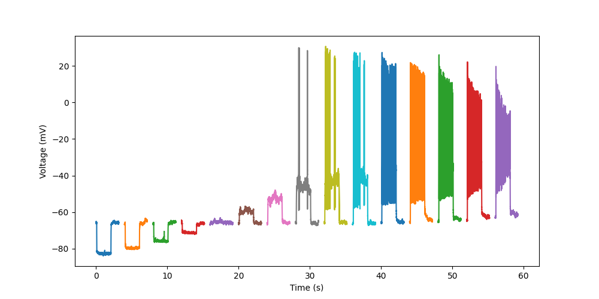

===========================================
Sharing neuroscience data in an open format
===========================================

.. FAIR, advantages of open formats

.. data from other formats, or from simulations

When sharing data and metadata, it is important to consider the `FAIR guiding principles`_.
Among these principles are *interoperability* and *reusability*, which include the idea that
data and metadata should be stored in a format that can be read by many different tools,
and should be thoroughly annotated with metadata.

In neurophysiology, a large fraction of experimental data are obtained using commercial setups
with dedicated software, which stores data in a proprietary format.
While Neo can help greatly in being able to read many proprietary formats,
(i) not everyone uses Python, and (ii) many metadata of interest cannot be contained in these formats,
and metadata labels do not in general use standardised terminologies.

Conversely, data from neuroscience simulations *are* often stored in open formats,
such as plain text files or HDF5, but with considerable variability between users
and little or no standardisation.

It is therefore advantageous to convert to, or write data directly in, an open format
that conforms to FAIR principles.

Neo supports two such formats:

- `NIX`_
- `Neurodata Without Borders (NWB)`_

Example
=======

Before getting into the details of the formats, we present an example dataset that will be used
to demonstrate the process of converting to open formats.

Our example is a public dataset, "`Whole cell patch-clamp recordings of cerebellar granule cells`_",
contributed to the EBRAINS_ repository by Marialuisa Tognolina from the laboratory of Egidio D'Angelo at the University of Pavia.

As we can see from the dataset description,

    *This dataset provides a characterization of the intrinsic excitability and synaptic properties of the cerebellar granule cells.
    Whole-cell patch-clamp recordings were performed on acute parasagittal cerebellar slices obtained from juvenile Wistar rats (p18-p24).
    Passive granule cells parameters were extracted in voltage-clamp mode by analyzing current relaxation induced by step voltage changes (IV protocol).
    Granule cells intrinsic excitability was investigated in current-clamp mode by injecting 2 s current steps (CC step protocol).
    Synaptic transmission properties were investigated in current clamp mode by an electrical stimulation of the mossy fibers bundle (5 pulses at 50 Hz, EPSP protocol).*

The dataset contains recordings from multiple subjects. For this example. let's download the data for Subject 15.
You can download them by hand, by selecting each file then selecting "Download file", or run the following code:

.. ipython::

    In [1]: from urllib.request import urlretrieve

    In [2]: from urllib.parse import quote

    In [3]: dataset_url = "https://object.cscs.ch/v1/AUTH_63ea6845b1d34ad7a43c8158d9572867/hbp-d000017_PatchClamp-GranuleCells_pub"

    In [4]: folder = "GrC_Subject15_180116"

    In [5]: filenames = ["180116_0004 IV -70.abf", "180116_0005 CC step.abf", "180116_0006 EPSP.abf"]

    In [6]: for filename in filenames:
       ...:     datafile_url = f"{dataset_url}/{folder}/{quote(filename)}"
       ...:     local_file = urlretrieve(datafile_url, filename)

Let's start with the current-clamp data. The data are in Axon format (suffix ".abf"),
so we could import :class:`~neo.io.AxonIO` directly,
but we can also ask Neo to guess the format using the :func:`get_io()` function:

.. ipython::

    In [7]: from neo.io import get_io

    In [8]: reader = get_io("180116_0005 CC step.abf")

    In [9]: data = reader.read()

    In [10]: data
    Out[10]:

We can see that the file contains a single :class:`Block`, containing 15 :class:`Segments`,
and each segment contains one :class:`AnalogSignal` with a single channel, and an :class:`Event`.

.. note: the events are essentially empty

To quickly take a look at the data, let's plot it:

.. ipython::

    In [11]: import matplotlib.pyplot as plt

    In [12]: fig = plt.figure(figsize=(10, 5))

    In [13]: for segment in data[0].segments:
       ....:     signal = segment.analogsignals[0]
       ....:     plt.plot(signal.times, signal)

    In [14]: plt.xlabel(f"Time ({signal.times.units.dimensionality.string})")

    In [15]: plt.ylabel(f"Voltage ({signal.units.dimensionality.string})")

    In [16]: plt.savefig("open_format_example_cc_step.png")

Now we've read the data into Neo, we're ready to write them to an open format.

NIX
===

The `NIX data model`_ allows storing a fully annotated scientific dataset, i.e. the data together with its metadata,
within a single container. The current implementations use the HDF5 file format as a storage backend.

For users of Neo, the advantage of NIX is that all Neo objects can be stored in an open format, HDF5,
readable with many different tools, without needing to add extra annotations or structure the dataset in any specific way.

Using Neo's :class:`~neo.io.NIXIO` requires some additional dependencies. To install Neo with NIXIO support, run::

    $ pip install neo[nixio]

Writing our example dataset to NIX format is straightforward:

.. ipython::

    In [17]: from neo.io import NixIO

    In [18]: writer = NixIO("GrC_Subject15_180116.nix", mode="ow")

    In [19]: writer.write(data)

Neurodata Without Borders (NWB)
===============================

`Neurodata Without Borders`_ (NWB:N) is an open standard file format for neurophysiology.

Using Neo's :class:`~neo.io.NWBIO` requires some additional dependencies. To install Neo with NWB support, run::

    $ pip install neo[nwb]

:class:`NWBIO` can read NWB 2.0-format files, and maps their structure onto Neo objects and annotations.

:class:`NWBIO` can also write to NWB 2.0 format.
Since NWB has a more complex structure than Neo's basic :class:`Block` - :class:`Segment` hierarchy,
and NWB requires fairly extensive metadata, it is recommended to annotate the Neo objects with special,
NWB-specific annotations, to ensure data and metadata are correctly placed within the NWB file.

The location of data stored in an NWB file depends on the source of the data, e.g. whether they are stimuli,
intracellular electrophysiology recordings, extracellular electrophysiology recordings, behavioural measuremenets, etc.
For this, we need to annotate all data objects with special metadata, identified by keys starting with "``nwb_``":

.. ipython::

    In [20]: signal_metadata = {
       ....:     "nwb_group": "acquisition",
       ....:     "nwb_neurodata_type": ("pynwb.icephys", "PatchClampSeries"),
       ....:     "nwb_electrode": {
       ....:         "name": "patch clamp electrode",
       ....:         "description": "The patch-clamp pipettes were pulled from borosilicate glass capillaries "
       ....:                        "(Hilgenberg, Malsfeld, Germany) and filled with intracellular solution "
       ....:                        "(K-gluconate based solution)",
       ....:         "device": {
       ....:            "name": "patch clamp electrode"
       ....:         }
       ....:     },
       ....:     "nwb:gain": 1.0
       ....: }

    In [21]: for segment in data[0].segments:
       ....:     signal = segment.analogsignals[0]
       ....:     signal.annotate(**signal_metadata)

We can also provide global metadata, either attaching them to a Neo :class:`Block`
or passing them to the :func:`write()` method.
Here we take metadata from the dataset description on the EBRAINS search portal:

.. ipython::

    In [22]: global_metadata = {
       ....:     "session_start_time": data[0].rec_datetime,
       ....:     "identifier": data[0].file_origin,
       ....:     "session_id": "180116_0005",
       ....:     "institution": "University of Pavia",
       ....:     "lab": "D'Angelo Lab",
       ....:     "related_publications": "https://doi.org/10.1038/s42003-020-0953-x"
       ....: }

Now that we have annotated our dataset, we can write it to an NWB file:

.. ipython::
   :okwarning:

   In [23]: from neo.io import NWBIO

   In [24]: writer = NWBIO("GrC_Subject15_180116.nwb", mode="w", **global_metadata)

   In [25]: writer.write(data)

.. note:: Neo support for NWB is a work-in-progress, it does not currently support NWB extensions for example.
          If you encounter a problem reading an NWB file with Neo, please make a `bug report`_ (see :doc:`bug_reports`).

.. _`Neurodata Without Borders`: https://www.nwb.org
.. _`bug report`: https://github.com/NeuralEnsemble/python-neo/issues/new
.. _`Whole cell patch-clamp recordings of cerebellar granule cells`: https://doi.org/10.25493/CHJG-7QC
.. _EBRAINS: https://ebrains.eu/services/data-and-knowledge/
.. _`NIX data model`: https://nixpy.readthedocs.io/
.. _`FAIR guiding principles`: https://doi.org/10.1038/sdata.2016.18