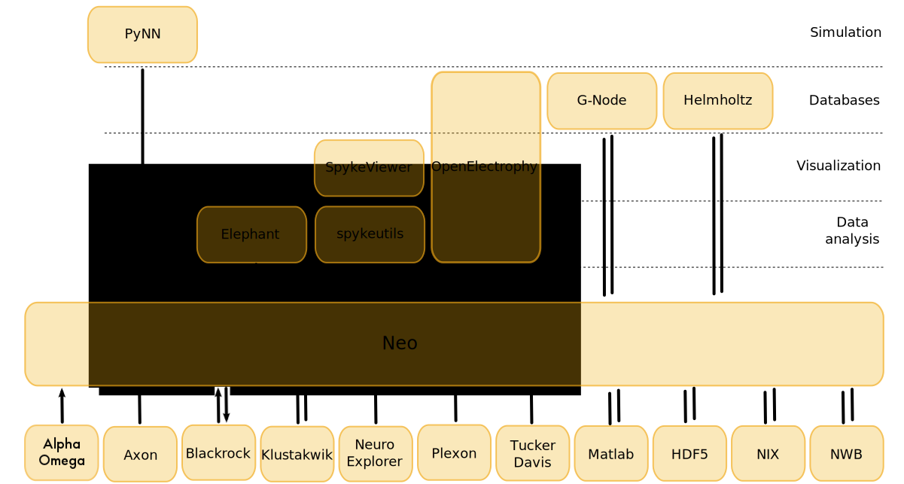

=============================
Using Neo in a library or app
=============================

.. Neo as a common layer for interoperability

The main goal of Neo is to act as an interoperability layer for any software that deals with
neurophysiology or optical imaging data, whether recorded experimentally or generated by simulations.

Any software that uses the Neo object model as its internal representation,
or which can import/export its internal data structures from/to Neo,
will be automatically compatible with all other software that does the same.

The following figure shows the Neo ecosystem: the Neo core classes, the IO modules,
and some of the software tools built on top of Neo.

To see more of the tools built on Neo, see the Github `dependency graph`_.
At the time of writing, Github records 394 repositories that depend on Neo,
of which 55 publish their own Python packages.

Dependability
=============

.. dependability - stable, community development, link to governance, continuous integration, testing library

If you're using Neo as a key dependency for your project, you need to be confident that Neo is a stable base
to build on. Here are some of the factors you might consider:

**API stability**
    Neo was first released in 2010. Since then we have been gradually refining and updating the object model,
    based on experience in real-world projects, and feedback from users.
    Any changes that will break users' code are introduced gradually, with deprecation warnings.
    We are getting close to releasing version 1.0, at which point we expect to maintain backwards-compatibility.

**Testing and continuous integration**
    Neo has an extensive test suite; we use Github Actions to run the tests whenever the code is changed.
    As part of this, we maintain an `open repository of data files`_ for all the formats Neo supports,
    which we use for our own tests and make available to others.

**Community**
    Neo uses a community development model, with defined rules of :doc:`governance` under which frequent
    contributors can become maintainers, and a `code of conduct`_.
    This community model means that Neo does not rely on any one source of funding.

**Licencing**
    Neo is open source software, available under a permissive BSD-3-clause `licence`_.

Performance
===========

.. low-level data reading - the RawIO layer (see rawio.rst)

With the increasing quantities of data that can be generated by modern recording methods
and by large-scale simulations, performance, in terms of both speed and memory consumption,
is highly important.

Neo has multiple optimizations to reduce import time, minimise the overhead due to using Neo objects
rather than plain NumPy arrays, and minimize memory footprint.

For using Neo as a dependency in another library of app, it is important to be aware of the
"raw" IO layer, which exposes a low-level read-only API based only on dictionaries and NumPy buffers.
Available for a large subset of the file formats Neo supports, the :mod:`neo.rawio` module
provide much of the benefit of Neo's multiple file-format support without needing to use
the Neo object model. For more details, see :doc:`rawio`.

.. _`dependency graph`: https://github.com/NeuralEnsemble/python-neo/network/dependents
.. _`open repository of data files`: https://gin.g-node.org/NeuralEnsemble/ephy_testing_data
.. _`licence`: https://github.com/NeuralEnsemble/python-neo/blob/master/LICENSE.txt
.. _`code of conduct`: https://github.com/NeuralEnsemble/python-neo/blob/master/CODE_OF_CONDUCT.md
