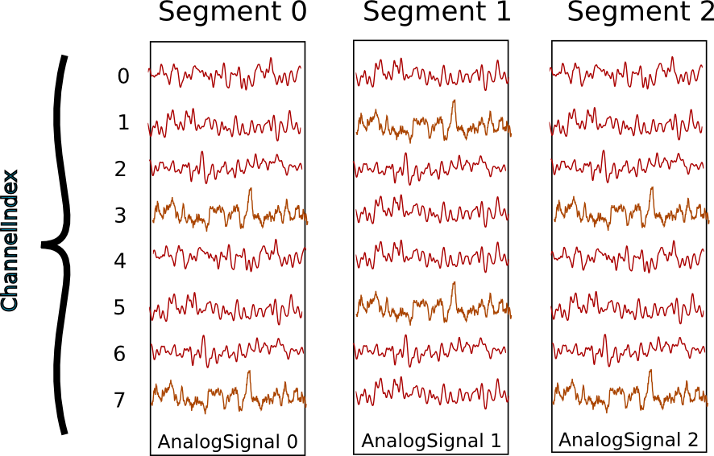
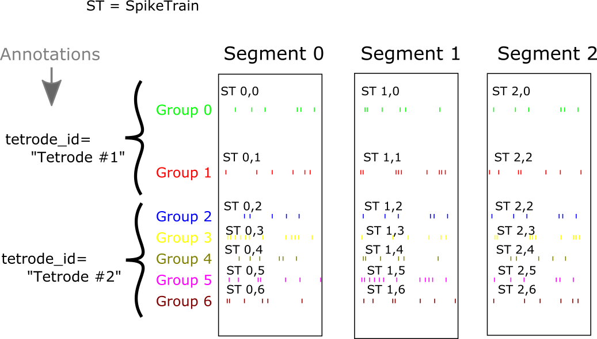

*****************
Typical use cases
*****************

Recording multiple trials from multiple channels
================================================

In this example we suppose that we have recorded from an 8-channel probe, and
that we have recorded three trials/episodes. We therefore have a total of
8 x 3 = 24 signals, each represented by an :class:`AnalogSignal` object.

Our entire dataset is contained in a :class:`Block`, which in turn contains:

  * 3 :class:`Segment` objects, each representing data from a single trial,
  * 1 :class:`RecordingChannelGroup`, composed of 8 :class:`RecordingChannel` objects.

:class:`Segment` and :class:`RecordingChannel` objects provide two different
ways to access the data, corresponding respectively, in this scenario, to access
by **time** and by **space**.

.. note:: segments do not always represent trials, they can be used for many
          purposes: segments could represent parallel recordings for different
          subjects, or different steps in a current clamp protocol.

**Temporal (by segment)**

In this case you want to go through your data in order, perhaps because you want
to correlate the neural response with the stimulus that was delivered in each segment.
In this example, we're averaging over the channels.

.. doctest::

    import numpy as np
    from matplotlib import pyplot as plt
    
    for seg in block.segments:
        print("Analyzing segment %d" % seg.index)
        
        siglist = seg.analogsignals
        avg = np.mean(siglist, axis=0)

        plt.figure()
        plt.plot(avg)
        plt.title("Peak response in segment %d: %f" % (seg.index, avg.max()))

**Spatial (by channel)**

In this case you want to go through your data by channel location and average over time. 
Perhaps you want to see which physical location produces the strongest response, and every stimulus was the same:
    
.. doctest::
    
    # We assume that our block has only 1 RecordingChannelGroup
    rcg = block.recordingchannelgroups[0]:
    for rc in rcg.recordingchannels:
        print("Analyzing channel %d: %s", (rc.index, rc.name))
        
        siglist = rc.analogsignals
        avg = np.mean(siglist, axis=0)
        
        plt.figure()
        plt.plot(avg)
        plt.title("Average response on channel %d: %s' % (rc.index, rc.name)

Note that :attr:`Block.list_recordingchannels` is a property that gives direct
access to all :class:`RecordingChannels`, so the two first lines::

    rcg = block.recordingchannelgroups[0]:
    for rc in rcg.recordingchannels:

could be written as::
    
    for rc in block.list_recordingchannels:

**Mixed example**

Combining simultaneously the two approaches of descending the hierarchy
temporally and spatially can be tricky. Here's an example.
Let's say you saw something interesting on channel 5 on even numbered trials
during the experiment and you want to follow up. What was the average response?

.. doctest::
    
    avg = np.mean([seg.analogsignals[5] for seg in block.segments[::2]], axis=1)
    plt.plot(avg)

Here we have assumed that segment are temporally ordered in a ``block.segments``
and that signals are ordered by channel number in ``seg.analogsignals``.
It would be safer, however, to avoid assumptions by explicitly testing the
:attr:`index` attribute of the :class:`RecordingChannel` and :class:`Segment`
objects. One way to do this is to loop over the recording channels and access
the segments through the signals (each :class:`AnalogSignal` contains a reference
to the :class:`Segment` it is contained in).
    
.. doctest::
    
    siglist = []
    rcg = block.recordingchannelgroups[0]:
    for rc in rcg.recordingchannels:
        if rc.index == 5:
            for anasig in rc.analogsignals:
                if anasig.segment.index % 2 == 0:
                    siglist.append(anasig)
    avg = np.mean(siglist)

Recording spikes from multiple tetrodes
=======================================

Here is a similar example in which we have recorded with two tetrodes and
extracted spikes from the extra-cellular signals. The spike times are contained
in :class:`SpikeTrain` objects.

Again, our data set is contained in a :class:`Block`, which contains:

  * 3 :class:`Segments` (one per trial).
  * 2 :class:`RecordingChannelGroups` (one per tetrode), which contain:
  
    * 4 :class:`RecordingChannels` each
    * 2 :class:`Unit` objects (= 2 neurons) for the first :class:`RecordingChannelGroup`
    * 5 :class:`Units` for the second :class:`RecordingChannelGroup`.

In total we have 3 x 7 = 21 :class:`SpikeTrains` in this :class:`Block`.

There are three ways to access the :class:`SpikeTrain` data:

  * by :class:`Segment`
  * by :class:`RecordingChannel`
  * by :class:`Unit`

**By Segment**

In this example, each :class:`Segment` represents data from one trial, and we
want a PSTH for each trial from all units combined:

.. doctest::

    for seg in block.segments:
        print("Analyzing segment %d" % seg.index)
        stlist = [st - st.t_start for st in seg.spiketrains]
        plt.figure()
        count, bins = np.histogram(stlist)
        plt.bar(bins[:-1], count, width=bins[1] - bins[0])
        plt.title("PSTH in segment %d" % seg.index)

**By Unit**

Now we can calculate the PSTH averaged over trials for each unit, using the
:attr:`block.list_units` property:

.. doctest::

    for unit in block.list_units:
        stlist = [st - st.t_start for st in unit.spiketrains]
        plt.figure()
        count, bins = np.histogram(stlist)
        plt.bar(bins[:-1], count, width=bins[1] - bins[0])
        plt.title("PSTH of unit %s" % unit.name)
        

**By RecordingChannelGroup**

Here we calculate a PSTH averaged over trials by channel location,
blending all units:

.. doctest::

    for rcg in block.recordingchannelgroups:
        stlist = []
        for unit in rcg.units:
            stlist.extend([st - st.t_start for st in unit.spiketrains])
        plt.figure()
        count, bins = np.histogram(stlist)
        plt.bar(bins[:-1], count, width=bins[1] - bins[0])
        plt.title("PSTH blend of tetrode  %s" % rcg.name)

Spike sorting
=============

Spike sorting is the process of detecting and classifying high-frequency
deflections ("spikes") on a group of physically nearby recording channels.

For example, let's say you have defined a RecordingChannelGroup for a tetrode
containing 4 separate channels. Here is an example showing (with fake data)
how you could iterate over the contained signals and extract spike times.
(Of course in reality you would use a more sophisticated algorithm.)

.. doctest::

    # generate some fake data
    rcg = RecordingChannelGroup()
    for n in range(4):
        rcg.recordingchannels.append(neo.RecordingChannel())
        rcg.recordingchannels[n].analogsignals.append(
            AnalogSignal([.1, -2.0, .1, -.1, -.1, -3.0, .1, .1], 
                sampling_rate=1000*Hz, units='V'))

    # extract spike trains from each channel
    st_list = []
    for n in range(len(rcg.recordingchannels[0].analogsignals)):
        sigarray = np.array(
            [rcg.recordingchannels[m].analogsignals[n] for m in range(4)])
        # use a simple threshhold detector
        spike_mask = np.where(np.min(sigarray, axis=0) < -1.0 * pq.V)[0]
        
        # create a spike train
        anasig = rcg.recordingchannels[m].analogsignals[n]
        spike_times = anasig.times[spike_mask]
        st = neo.SpikeTrain(spike_times, t_start=anasig.t_start,
            anasig.t_stop)
        
        # remember the spike waveforms
        wf_list = []
        for spike_idx in np.nonzero(spike_mask)[0]:
            wf_list.append(sigarray[:, spike_idx-1:spike_idx+2])
        st.waveforms = np.array(wf_list)
        
        st_list.append(st)

At this point, we have a list of spiketrain objects. We could simply create
a single Unit object, assign all spike trains to it, and then assign the
Unit to the group on which we detected it.

.. doctest::
    
    u = Unit()
    u.spiketrains = st_list
    rcg.units.append(u)

Now the recording channel group (tetrode) contains a list of analogsignals,
and a single Unit object containing all of the detected spiketrains from those
signals.

Further processing could assign each of the detected spikes to an independent
source, a putative single neuron. (This processing is outside the scope of
Neo. There are many open-source toolboxes to do it, for instance our sister
project OpenElectrophy.)

In that case we would create a separate Unit for each cluster, assign its
spiketrains to it, and then store all the units in the original
recording channel group.

.. EEG

.. Network simulations

