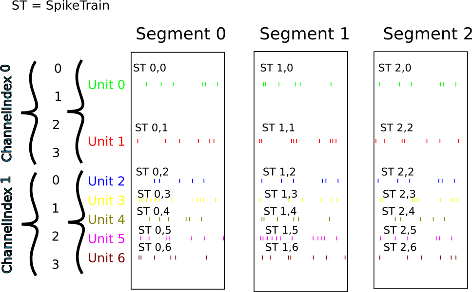

*****************
Typical use cases
*****************

Recording multiple trials from multiple channels
================================================

In this example we suppose that we have recorded from an 8-channel probe, and
that we have recorded three trials/episodes. We therefore have a total of
8 x 3 = 24 signals, grouped into three :class:`AnalogSignal` objects, one per trial.

Our entire dataset is contained in a :class:`Block`, which in turn contains:

  * 3 :class:`Segment` objects, each representing data from a single trial,
  * 1 :class:`Group`.

.. image:: images/multi_segment_diagram.png
   :width: 75%
   :align: center

:class:`Segment` and :class:`Group` objects provide two different
ways to access the data, corresponding respectively, in this scenario, to access
by **time** and by **space**.

.. note:: Segments do not always represent trials, they can be used for many
          purposes: segments could represent parallel recordings for different
          subjects, or different steps in a current clamp protocol.

**Temporal (by segment)**

In this case you want to go through your data in order, perhaps because you want
to correlate the neural response with the stimulus that was delivered in each segment.
In this example, we're averaging over the channels.

.. doctest::

    import numpy as np
    from matplotlib import pyplot as plt

    for seg in block.segments:
        print("Analyzing segment %d" % seg.index)

        avg = np.mean(seg.analogsignals[0], axis=1)

        plt.figure()
        plt.plot(avg)
        plt.title("Peak response in segment %d: %f" % (seg.index, avg.max()))

**Spatial (by channel)**

In this case you want to go through your data by channel location and average over time.
Perhaps you want to see which physical location produces the strongest response, and every stimulus was the same:

.. doctest::

    # We assume that our block has only 1 Group
    group = block.groups[0]
    avg = np.mean(group.analogsignals, axis=0)

    plt.figure()
    for index, name in enumerate(group.annotations["channel_names"]):
        plt.plot(avg[:, index])
        plt.title("Average response on channels %s: %s' % (index, name)

**Mixed example**

Combining simultaneously the two approaches of descending the hierarchy
temporally and spatially can be tricky. Here's an example.
Let's say you saw something interesting on the 6th channel (index 5) on even numbered trials
during the experiment and you want to follow up. What was the average response?

.. doctest::

    index = 5
    avg = np.mean([seg.analogsignals[0][:, index] for seg in block.segments[::2]], axis=1)
    plt.plot(avg)

Recording spikes from multiple tetrodes
=======================================

Here is a similar example in which we have recorded with two tetrodes and
extracted spikes from the extra-cellular signals. The spike times are contained
in :class:`SpikeTrain` objects.

  * 3 :class:`Segments` (one per trial).
  * 7 :class:`Groups` (one per neuron), which each contain:

    * 3 :class:`SpikeTrain` objects
    * an annotation showing which tetrode the spiketrains were recorded from

In total we have 3 x 7 = 21 :class:`SpikeTrains` in this :class:`Block`.

.. note:: In this scenario we have discarded the original signals, perhaps to save
          space, therefore we use annotations to link the spiketrains to the tetrode
          they were recorded from. If we wished to include the original
          extracellular signals, we would add a reference to the three :class:`AnalogSignal`
          objects for the appropriate tetrode to the :class:`Group` for each neuron.

There are three ways to access the :class:`SpikeTrain` data:

  * by trial (:class:`Segment`)
  * by neuron (:class:`Group`)
  * by tetrode

**By trial**

In this example, each :class:`Segment` represents data from one trial, and we
want a PSTH for each trial from all units combined:

.. doctest::

    plt.figure()
    for seg in block.segments:
        print(f"Analyzing segment {seg.index}")
        stlist = [st - st.t_start for st in seg.spiketrains]
        plt.subplot(len(block.segments), 1, seg.index + 1)
        count, bins = np.histogram(stlist)
        plt.bar(bins[:-1], count, width=bins[1] - bins[0])
        plt.title(f"PSTH in segment {seg.index}")
    plt.show()

**By neuron**

Now we can calculate the PSTH averaged over trials for each unit, using the
:attr:`block.groups` property:

.. doctest::

    plt.figure()
    for i, group in enumerate(block.groups):
        stlist = [st - st.t_start for st in group.spiketrains]
        plt.subplot(len(block.groups), 1, i + 1)
        count, bins = np.histogram(stlist)
        plt.bar(bins[:-1], count, width=bins[1] - bins[0])
        plt.title(f"PSTH of unit {group.name}")
    plt.show()

**By tetrode**

Here we calculate a PSTH averaged over trials by channel location,
blending all units:

.. doctest::

    plt.figure()
    for i, tetrode_id in enumerate(block.annotations["tetrode_ids"]):
        stlist = []
        for unit in block.filter(objects=Group, tetrode_id=tetrode_id):
            stlist.extend([st - st.t_start for st in unit.spiketrains])
        plt.subplot(2, 1, i + 1)
        count, bins = np.histogram(stlist)
        plt.bar(bins[:-1], count, width=bins[1] - bins[0])
        plt.title(f"PSTH blend of tetrode {tetrode_id}")
    plt.show()

Spike sorting
=============

Spike sorting is the process of detecting and classifying high-frequency
deflections ("spikes") on a group of physically nearby recording channels.

For example, let's say you have recordings from a tetrode
containing 4 separate channels. Here is an example showing (with fake data)
how you could iterate over the contained signals and extract spike times.
(Of course in reality you would use a more sophisticated algorithm.)

.. doctest::

    # generate some fake data
    seg = Segment()
    seg.analogsignals.append(
        AnalogSignal([[0.1, 0.1, 0.1, 0.1],
                    [-2.0, -2.0, -2.0, -2.0],
                    [0.1, 0.1, 0.1, 0.1],
                    [-0.1, -0.1, -0.1, -0.1],
                    [-0.1, -0.1, -0.1, -0.1],
                    [-3.0, -3.0, -3.0, -3.0],
                    [0.1, 0.1, 0.1, 0.1],
                    [0.1, 0.1, 0.1, 0.1]],
                    sampling_rate=1000*Hz, units='V'))

    # extract spike trains from all channels
    st_list = []
    for signal in seg.analogsignals:
        # use a simple threshhold detector
        spike_mask = np.where(np.min(signal.magnitude, axis=1) < -1.0)[0]

        # create a spike train
        spike_times = signal.times[spike_mask]
        st = SpikeTrain(spike_times, t_start=signal.t_start, t_stop=signal.t_stop)

        # remember the spike waveforms
        wf_list = []
        for spike_idx in np.nonzero(spike_mask)[0]:
            wf_list.append(signal[spike_idx-1:spike_idx+2, :])
        st.waveforms = np.array(wf_list)

        st_list.append(st)

At this point, we have a list of spiketrain objects. We could simply create
a single :class:`Group` object, assign all spiketrains to it, and then also assign the
:class:`AnalogSignal` on which we detected them.

.. doctest::

    unit = Group()
    unit.spiketrains = st_list
    unit.analogsignals.extend(seg.analogsignals)

Further processing could assign each of the detected spikes to an independent
source, a putative single neuron. (This processing is outside the scope of
Neo. There are many open-source toolboxes to do it, for instance our sister
project OpenElectrophy.)

In that case we would create a separate :class:`Group` for each cluster, assign its
spiketrains to it, and still store in each group a reference to the original
recording.

.. EEG

.. Network simulations
